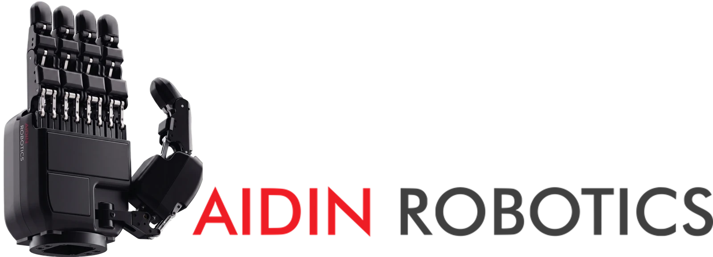

<div align="center">

<a href="https://www.aidinrobotics.co.kr/"></a>

<h1>AIDIN Hand Gen2 GUI</h1>

The GUI for the AIDIN Hand Gen2, a robot hand with integrated tactile sensors. It connects to the robot
hand through the SDK or ROS 2.

[](https://github.com/aidinrobotics/aidin-hand2-sdk) [](#1-system-requirements)

[Install](#2-install-the-dependencies) | [Tutorial](#4-tutorial) | [Official Site](https://www.aidinrobotics.co.kr/) | English | [한국어](README.ko.md)

</div>

## Contents

&nbsp;&nbsp;[**1. System requirements**](#1-system-requirements)<br>
&nbsp;&nbsp;[**2. Install the dependencies**](#2-install-the-dependencies)<br>
&nbsp;&nbsp;&nbsp;&nbsp;&nbsp;&nbsp;[2.1 Install the SDK](#21-install-the-sdk)<br>
&nbsp;&nbsp;&nbsp;&nbsp;&nbsp;&nbsp;[2.2 Install the ROS 2 wrapper](#22-install-the-ros-2-wrapper)<br>
&nbsp;&nbsp;&nbsp;&nbsp;&nbsp;&nbsp;[2.3 Set up the real-time kernel](#23-set-up-the-real-time-kernel)<br>
&nbsp;&nbsp;[**3. Install the app**](#3-install-the-app)<br>
&nbsp;&nbsp;[**4. Tutorial**](#4-tutorial)<br>
&nbsp;&nbsp;&nbsp;&nbsp;&nbsp;&nbsp;[4.1 Basics](#41-basics)<br>
&nbsp;&nbsp;&nbsp;&nbsp;&nbsp;&nbsp;[4.2 Connect through ROS 2](#42-connect-through-ros-2)<br>
&nbsp;&nbsp;&nbsp;&nbsp;&nbsp;&nbsp;[4.3 Connect through the SDK](#43-connect-through-the-sdk)<br>
&nbsp;&nbsp;[**5. Close the app**](#5-close-the-app)<br>
&nbsp;&nbsp;[**6. Troubleshooting**](#6-troubleshooting)<br>
&nbsp;&nbsp;[**7. Uninstall**](#7-uninstall)<br>
&nbsp;&nbsp;[**8. Related repositories**](#8-related-repositories)<br>
&nbsp;&nbsp;[**9. License**](#9-license)

## 1. System requirements

| Component | Requirement |
|---|---|
| Operating System | Ubuntu 22.04 (amd64 · arm64) |
| SDK | [aidin-hand2-sdk](https://github.com/aidinrobotics/aidin-hand2-sdk) 0.7.x, installed in `/usr/local` |
| CAN interface | USB CAN-FD adapter (SocketCAN), 1 Mbit/s nominal, 5 Mbit/s data phase |
| ROS 2 (optional) | ROS 2 Humble, [aidin-hand2-ros2](https://github.com/aidinrobotics/aidin-hand2-ros2) |

## 2. Install the dependencies

The app runs the web bridge (`aidin_hand2_web_bridge`), an HTTP and WebSocket server that connects the
app's screens to the robot hand. With a `web bridge` profile (Standalone) the web bridge drives the robot
hand through the SDK, and with a `ros2` profile it reaches the robot hand through rosbridge. It uses the SDK library either way, so install
the SDK on every PC that runs the app, including one that connects through ROS 2 or has no robot hand.

2.2 and 2.3 are for the PC the robot hand is connected to (the robot PC below), and only when you need
them.

### 2.1 Install the SDK

Install the packages the SDK builds with and get the SDK 0.7 release.

```bash
sudo apt update
sudo apt install -y build-essential cmake git libspdlog-dev can-utils
git clone --branch v0.7.0 https://github.com/aidinrobotics/aidin-hand2-sdk.git
cd aidin-hand2-sdk
```

> [!IMPORTANT]
> **AIDIN Hand Gen2 comes in hand types A, B and C, and you choose the type when you build the SDK.**
> The kinematics differ by type. AIDIN Robotics tells you the type when it delivers the robot hand. If you
> use only `mock`, the default `a` is fine.

Replace `a` in the command below with your type (`a`, `b` or `c`), run it, and check the type in the output.

```bash
cmake -S cpp -B cpp/build -DCMAKE_BUILD_TYPE=RelWithDebInfo -DAIDIN_HAND2_HAND_TYPE=a
```

```text
-- aidin_hand2: hand type = a
```

> [!IMPORTANT]
> Install the SDK in `/usr/local`. The app finds only the libraries that `sudo ldconfig` registers, so it
> does not start with the SDK installed in a user prefix (`~/.local`), which the SDK documentation also
> describes.

Build and install.

```bash
cmake --build cpp/build -j"$(nproc)"
sudo cmake --install cpp/build
sudo ldconfig
```

Check that the library is registered. On an arm64 PC the parentheses read `libc6,AArch64`.

```bash
ldconfig -p | grep libaidin_hand2.so.0.7
```

```text
	libaidin_hand2.so.0.7 (libc6,x86-64) => /usr/local/lib/libaidin_hand2.so.0.7
```

The SDK tests and how to uninstall the SDK are in
[SDK build & install](https://github.com/aidinrobotics/aidin-hand2-sdk/blob/main/docs/en/06_sdk_build_and_install.md).

### 2.2 Install the ROS 2 wrapper

This is for connecting through ROS 2 only. The app can run on the robot PC or on another PC on the same
network. The PC that runs the app needs no ROS 2, only the SDK from 2.1 and the app.

Install ROS 2 Humble and the wrapper on the robot PC as in
[Installation](https://github.com/aidinrobotics/aidin-hand2-ros2/blob/main/docs/ko/03_installation.md)
(in Korean). The `rosdep install` step of that guide also installs rosbridge_server, which the app connects
to.

### 2.3 Set up the real-time kernel

This is optional. To schedule the 500 Hz control and communication loop in real time, set up the
PREEMPT_RT kernel and the real-time permissions on the robot PC as in
[Real-time kernel setup](https://github.com/aidinrobotics/aidin-hand2-sdk/blob/main/docs/en/04_real_time_kernel_setup.md).
Without the permissions the SDK logs a warning and runs without real-time scheduling.

## 3. Install the app

Download the `.deb` file for your PC's architecture from
[Releases](https://github.com/aidinrobotics/aidin-hand2-gui/releases): `amd64` for an x86_64 PC, `arm64`
for an arm64 PC such as a Jetson. `dpkg --print-architecture` shows the architecture.

Install it from the folder that holds the file. Replace `<version>` with the version of the file.

```bash
sudo apt install ./aidin-hand2-gui_<version>_amd64.deb
```

The app menu then shows **AIDIN Hand GUI**, and `aidin-hand2-gui` starts it from a terminal. A PC runs one
app at a time. Starting the app again while it runs brings its open window to the front.

## 4. Tutorial

The tutorial takes you through the app one step at a time: it lights up what to press, and when the app
sees that the step is done, it shows what changed. **Next** moves on to the next step.

1. Start **AIDIN Hand GUI** from the app menu, or run `aidin-hand2-gui` in a terminal.
2. On the start screen, click the tutorial button, the open book at the top right. The tutorial list
   opens.

   
3. Click **Start** on chapter 1, 2 or 3, or click one of the guides under it to begin there.

Start with chapter 1, Basics, if the app is new to you. **Quit tutorial** ends the tutorial at any step.

> [!WARNING]
> Chapters 2 and 3 end by homing the robot hand, and its fingers move while it homes. Keep the area around
> the robot hand clear.

### 4.1 Basics

Chapter 1 runs on a practice hand, so the app is all you need. Nothing you press reaches a robot hand, and
the tutorial deletes the preset and the sequence you make in it.

| Guide | What it covers |
|---|---|
| Hand states | The hand's states in the top bar, connecting, running and homing, stopping, the diagnostics window, recovering from Faulted |
| Sending commands | The State panel, Joint Position and its Preview, Set command and Live, presets, zero target and capture pose, the controller config and max effort, the Iso and Front views |
| Sequences | Building a sequence from Home, Wait, command and Loop blocks, playing it, and the keys for editing blocks |
| Tactile sensing | The tactile panel, the Raw, Normalized and Index views, Calibrate, the heatmap on the 3D hand |

### 4.2 Connect through ROS 2

Chapter 2 needs the robot hand, and on the robot PC the wrapper from
[2.2 Install the ROS 2 wrapper](#22-install-the-ros-2-wrapper). The chapter gives the commands that launch
rosbridge (`gui_bridge.launch.py`) and the bringup (`aidin_hand2.launch.py`) on the robot PC, walks you
through a `ros2` profile, and ends when the robot hand is homed.

> [!WARNING]
> rosbridge provides no authentication and no TLS. With the defaults, anyone on the same network can send
> commands to the robot hand. If the app runs only on the robot PC, add `address:=127.0.0.1` to the
> `gui_bridge.launch.py` command so that rosbridge accepts connections from this PC only.

| Guide | What it covers |
|---|---|
| Prepare the PC | Checking the ROS 2 workspace, bringing up CAN-FD, finding which hand answers on the CAN interface |
| Start ROS 2 | Starting rosbridge and the bringup, which the app checks as they come up |
| Connect the GUI | Adding a `ros2` profile, checking the topic and service names, ENTER, homing the robot hand |

The chapter's bringup commands start one hand. For both hands and the other launch arguments, see the
wrapper's
[2. Robot hand](https://github.com/aidinrobotics/aidin-hand2-ros2/blob/main/docs/ko/04_bringup.md#2-robot-hand)
(in Korean).

### 4.3 Connect through the SDK

Chapter 3 needs the robot hand connected to this PC. The chapter gives the CAN-FD commands, walks you
through a `web bridge` profile, and ends when the robot hand is connected and homed. The SDK's
[CAN-FD setup](https://github.com/aidinrobotics/aidin-hand2-sdk/blob/main/docs/en/05_can_fd_setup.md)
explains the CAN-FD commands in more detail.

| Guide | What it covers |
|---|---|
| Prepare the PC | Checking the SDK's hand type, bringing up CAN-FD, finding which hand answers |
| Create a profile | Adding a `web bridge` profile with the hand, its CAN interface and `auto_home` |
| Connect and home | ENTER, connecting the robot hand, running it and homing it |

## 5. Close the app

The window has no title bar. The buttons at the right end of the top bar take its place: **−** minimizes
the window and the fullscreen button fills the screen. **✕** on the main screen returns to the profile
screen, and **✕** on the profile screen closes the app. Drag an empty part of the top bar to move the
window.

After you enter a `web bridge` or `ros2` profile, closing and reopening the app enters that profile again
without the profile screen. To switch profiles, return to the profile screen with **✕**.

What happens to the robot hand when you close the app depends on the profile's source.

| Source | When you close the app |
|---|---|
| `web bridge` | The app stops the web bridge and then quits. The robot hand stops its actuators and closes communication |
| `ros2` | The robot hand keeps running on the robot PC. To end it, stop the `aidin_hand2.launch.py` and `gui_bridge.launch.py` you launched there with Ctrl+C |

## 6. Troubleshooting

When the web bridge cannot run, the window shows the reason and the web bridge's output.

| Message | Action |
|---|---|
| `The AIDIN Hand SDK (libaidin_hand2) is not installed on this PC.` | The app did not find SDK 0.7.x. The message also appears when only another SDK version is installed. Finish [2.1 Install the SDK](#21-install-the-sdk) and start the app again |
| `Another program holds the web bridge port.` | Another program uses port 26350. Find out which program it is with `sudo ss -ltnp \| grep 26350`.<ul><li>If the name after `users:` is `aidin_hand2_web`, a web bridge from an earlier run has hung. Run `kill <pid>` with the number after `pid=`, then start the app again. If the process does not end, use `kill -9 <pid>`</li><li>If it is another program that you need to keep running, start the app on another port from a terminal, for example `aidin-hand2-gui --port 26360`</li></ul> |
| `The web bridge keeps stopping.` | The web bridge stopped five times in a row. The output in the window shows the cause |

## 7. Uninstall

```bash
sudo apt remove aidin-hand2-gui
```

The profiles and the settings you saved in the app stay in `~/.local/share/aidin-hand2-gui`, so a
reinstall picks them up. To remove everything, delete that folder and `~/.config/AIDIN Hand GUI`. To
uninstall the SDK, see the SDK's
[5. Uninstall](https://github.com/aidinrobotics/aidin-hand2-sdk/blob/main/docs/en/06_sdk_build_and_install.md#5-uninstall).

## 8. Related repositories

- [aidin-hand2-sdk](https://github.com/aidinrobotics/aidin-hand2-sdk) — the C++ SDK
- [aidin-hand2-ros2](https://github.com/aidinrobotics/aidin-hand2-ros2) — the ROS 2 wrapper

## 9. License

The AIDIN Hand Gen2 GUI is licensed under the [Apache License 2.0](LICENSE). [NOTICE](NOTICE)
holds the attribution notice that the license requires a downstream distribution to carry.

The `.deb` package also carries third-party software, such as Electron and the libraries built
into the page. [THIRD_PARTY_NOTICES.md](THIRD_PARTY_NOTICES.md) lists each component with its
license and where its source can be obtained, and [licenses/](licenses) holds the full license
texts. The package installs these files with the app in `/opt/AIDIN Hand GUI/`.
